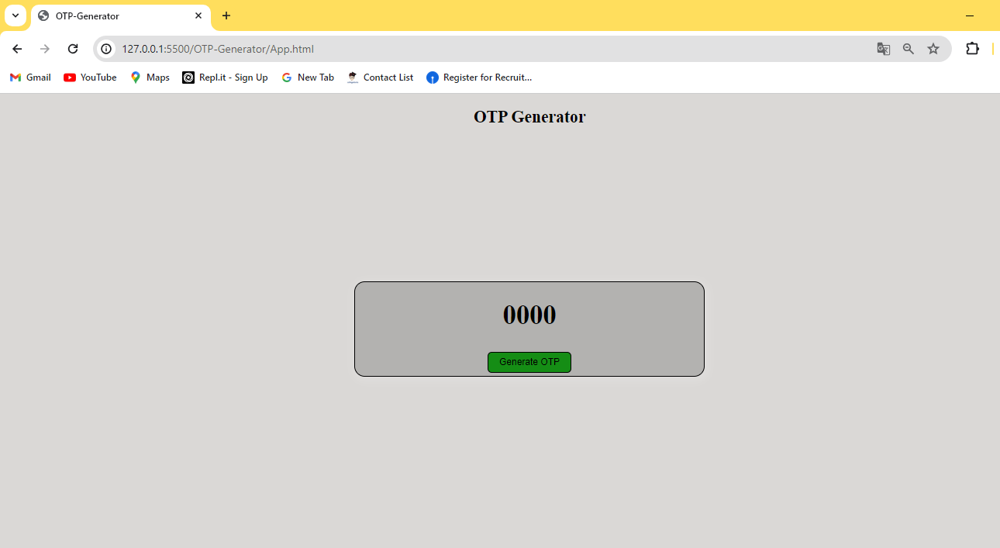
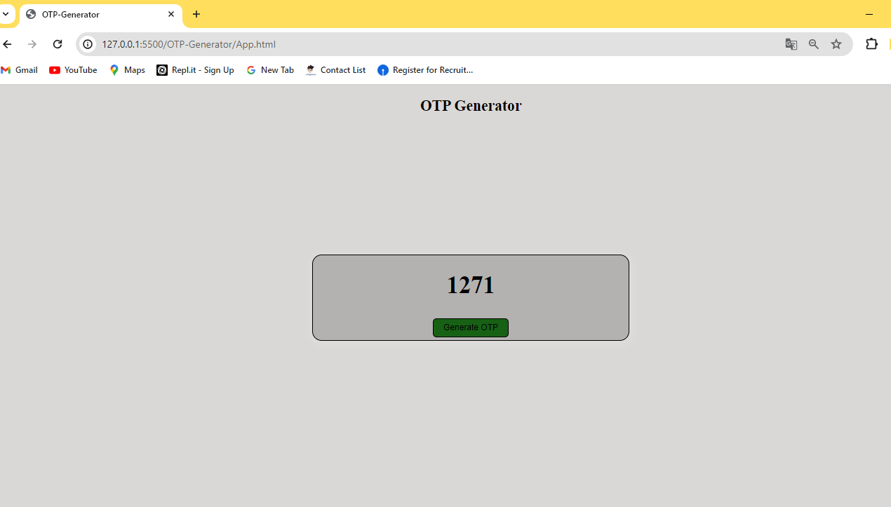

# OTP Generator

A simple web application that generates a One-Time Password (OTP) using HTML, CSS, and JavaScript. This project demonstrates basic web development concepts and client-side scripting to create a dynamic interaction.

## Features

- **Generate OTP**: Click the button to generate a random 4-digit OTP.
- **Responsive UI**: The application adjusts to various screen sizes while maintaining a central alignment for its contents.
- **Stylish Design**: Uses CSS for aesthetic enhancements, including button hover effects and box shadows.

## Getting Started

### Prerequisites

Ensure you have a modern web browser installed such as Google Chrome, Firefox, Safari, or Edge to run the application.

### Installation

1. Clone the repository or download the ZIP file.
2. Extract the contents if you downloaded a ZIP.
3. Open the `index.html` file in a web browser to run the application.

### Files Included

- `index.html`: The main HTML document.
- `App.css`: Contains styles for the application.
- An additional JavaScript script embedded within the `index.html` for OTP generation logic.

## Usage

Open the `index.html` file in your web browser. Click the "Generate OTP" button to see a new OTP displayed each time. The OTP appears in a styled box at the center of the page.

## Code Explanation

### HTML

The HTML file sets up the structure, linking to a CSS file for styling and preparing a button that, when clicked, triggers an OTP generation.

### CSS

Styles are provided for:
- Background colors
- Centering the OTP display box
- Button styles and hover effects

### JavaScript

A function named `Appfun` is defined to generate a random 4-digit number. It listens for button clicks to trigger this function, updating the displayed OTP in the HTML.

## Contributing

Feel free to fork this project and make your own changes. Pull requests for improvements are welcome.

### Output Screen

- Before Generated OTP
#### Before OTP
  

- After Generated OTP
#### AFTER OTP
   